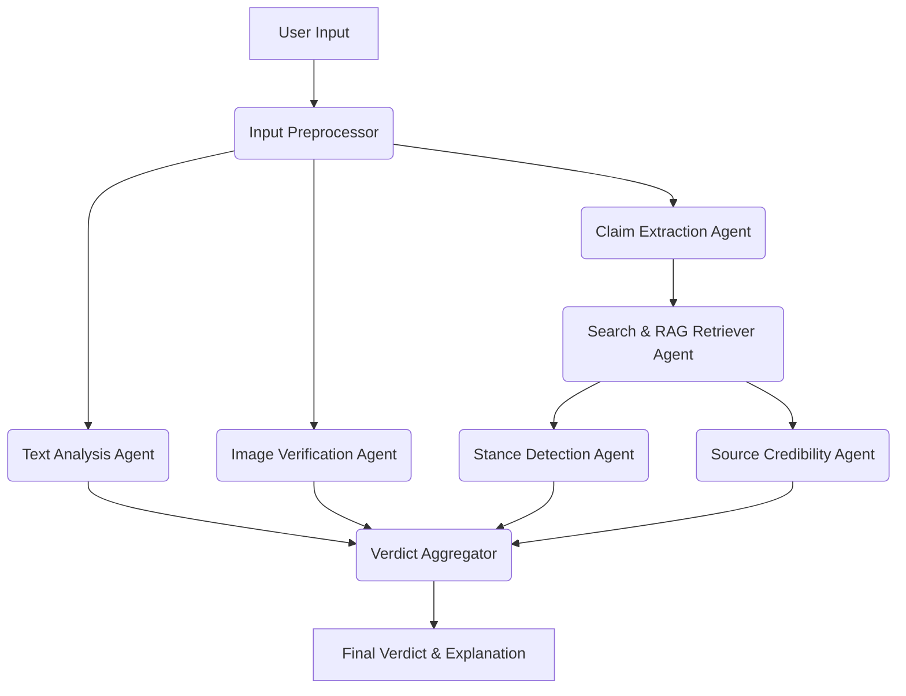

# Aletheia — Fake News Detection using NLP

Aletheia is an evidence-driven, multimodal news and claim verification system that combines transformer-based NLP, claim extraction, live web retrieval, trusted-source RAG, source credibility analysis, NLI-based evidence stance detection, image verification, and explainable verdict generation.

## Features

- **Claim Extraction:** Extracts factual claims from articles instead of just using the first 200 characters.
- **True Parallel Architecture:** Uses LangGraph for parallel execution of agents.
- **Evidence Stance Detection (NLI):** Uses `cross-encoder` NLI to explicitly calculate if evidence SUPPORTS or CONTRADICTS a claim.
- **Trusted-Source RAG:** Ingests full documents with metadata into ChromaDB.
- **Multi-Factor Source Credibility:** Safely parses domain names and ranks credibility based on domain reputation.
- **Multimodal Checking:** Supports perceptual hashing (pHash) for reverse image search.
- **Explainable Verdicts:** Uses Llama 3.1 to summarize findings, giving a final verdict of REAL, FAKE, or UNVERIFIED with confidence levels.

## Architecture


## Installation & Environment Setup

1. **Clone the repo**
   ```bash
   git clone https://github.com/laikacuriosity/Fake_news_detection.git .
   ```
2. **Setup virtual environment**
   ```bash
   python -m venv venv
   source venv/bin/activate  # Or venv\Scripts\activate on Windows
   ```
3. **Install dependencies**
   ```bash
   pip install -r backend/requirements.txt
   ```
4. **Environment Variables**
   Create a `.env` file in the root based on `.env.example`.

## Running the Application

### Backend
Start the FastAPI server:
```bash
cd backend
uvicorn app:app --reload
```

### Frontend
Since it's a static HTML file, simply open `frontend/index.html` in your browser. Or serve it via a simple HTTP server:
```bash
cd frontend
python -m http.server 3000
```

## Setup Ollama
Make sure you have Ollama running locally with `llama3.1` model installed.
```bash
ollama run llama3.1
```

## API Documentation

- `POST /verify`: Submit a JSON body with `{"article": "...", "image_url": "..."}`
- `POST /rag/ingest-manual`: Ingest manual articles into ChromaDB.
- `GET /rag/query`: Test the RAG database.

## Project Limitations & Future Scope
- The NLI model handles short snippets well but could be extended to full-page reasoning.
- Image verification currently relies on exact hash matching; perceptual embeddings could be used instead.
- Benchmark evaluations on datasets like LIAR and FakeNewsNet are recommended.
